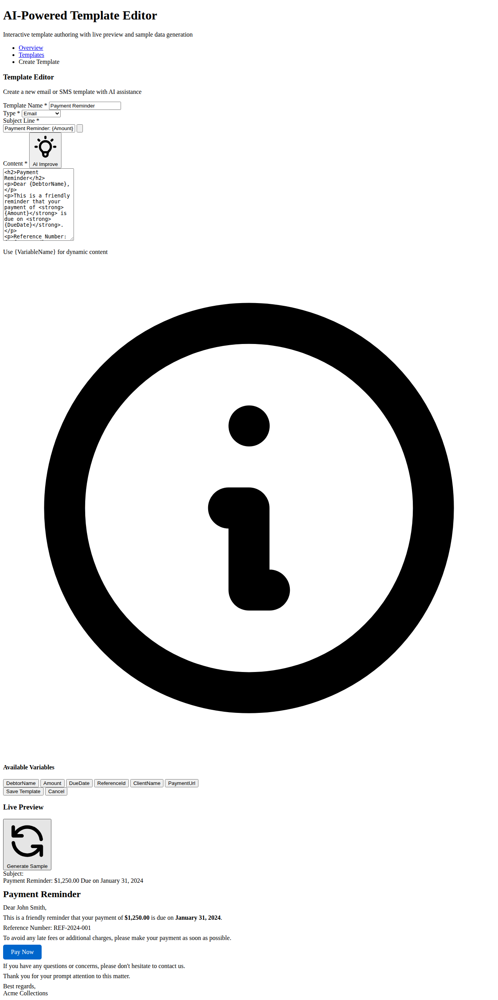
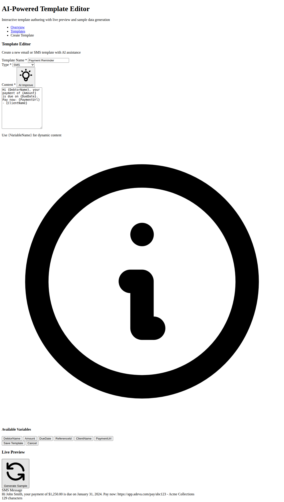

# AI-Powered Interactive Template Authoring

This feature provides an advanced template editor with AI assistance, live preview, and sample data generation for creating email and SMS templates.


*Email template editor with AI-generated content and live preview*

## Screenshots

### Email Template Editor


### SMS Template Editor


### Live Preview in Action


## Features

### 1. **Live Preview**
- Real-time rendering of templates as you type
- Automatic variable substitution with sample data
- Separate preview modes for Email and SMS templates
- Character count for SMS templates (160 character limit indicator)

### 2. **AI-Powered Sample Generation**
- Click "Generate Sample" to create complete template content
- Context-aware generation based on template name and type
- Generates appropriate subject lines for emails
- Creates SMS-optimized short messages

### 3. **AI Subject Line Suggestions**
- Analyzes template content to suggest relevant subject lines
- Click the lightbulb icon next to the subject field
- Generates context-appropriate subjects based on:
  - Payment reminders
  - Payment confirmations
  - Account notices
  - General messages

### 4. **AI Content Improvement**
- Click "AI Improve" to enhance existing content
- For Email templates:
  - Adds proper HTML structure
  - Ensures greeting and closing
  - Wraps plain text in paragraphs
- For SMS templates:
  - Optimizes for 160 character limit
  - Preserves important URLs
  - Trims excess content intelligently

### 5. **Variable Management**
- Quick-insert buttons for all available variables:
  - `{DebtorName}` - Debtor's full name
  - `{Amount}` - Amount owed/paid
  - `{DueDate}` - Payment due date
  - `{ReferenceId}` - Debt reference ID
  - `{ClientName}` - Creditor organization name
  - `{PaymentUrl}` - Link to make payment
- Click any variable tag to insert at cursor position
- Variables are highlighted in the preview with sample data

## Usage Guide

### Creating a New Template

1. **Navigate to Template Creation**
   - Go to Admin → Communications → Templates
   - Click "+ Create Template" button

2. **Basic Information**
   - Enter a descriptive template name (e.g., "Payment Reminder")
   - Select template type (Email or SMS)

3. **For Email Templates**
   - Enter or generate a subject line
   - Use HTML formatting in content area
   - Click "AI Improve" to enhance formatting

4. **For SMS Templates**
   - Keep content under 160 characters
   - Use concise language
   - Monitor character count in preview

5. **Using AI Assistance**
   - **Generate Sample**: Creates complete template content
   - **AI Subject Suggestions**: Click lightbulb icon for subject ideas
   - **AI Improve**: Enhances existing content with proper structure

6. **Insert Variables**
   - Click variable tags to insert at cursor position
   - Or manually type `{VariableName}` in the content

7. **Preview Your Template**
   - Live preview updates as you type
   - See how variables will be replaced with actual data
   - Verify email HTML rendering or SMS character count

8. **Save Template**
   - Click "Save Template" when satisfied
   - Template is now available for use in communications

## API Endpoints

### Generate Sample Template
```
POST /Admin/Comms/GenerateSampleTemplate
Content-Type: application/json

{
  "type": "email" | "sms",
  "name": "Template Name"
}

Response:
{
  "subject": "Subject line (for email)",
  "content": "Template content"
}
```

### Suggest Subject Line
```
POST /Admin/Comms/SuggestSubject
Content-Type: application/json

{
  "content": "Template content",
  "name": "Template Name"
}

Response:
{
  "suggestion": "AI-generated subject line"
}
```

### Improve Content
```
POST /Admin/Comms/ImproveContent
Content-Type: application/json

{
  "content": "Original content",
  "type": "email" | "sms"
}

Response:
{
  "improved": "Enhanced content"
}
```

## Technical Implementation

### Frontend Components
- **CreateTemplate.cshtml**: New template creation view
- **EditTemplate.cshtml**: Template editing view
- **JavaScript**: Live preview, AI interactions, variable insertion

### Backend Components
- **CommsController**: API endpoints for AI features
  - `GenerateSampleTemplate()`: Sample generation
  - `SuggestSubject()`: Subject line suggestions
  - `ImproveContent()`: Content enhancement

### Sample Data
The system uses predefined sample data for preview:
- DebtorName: "John Smith"
- Amount: "$1,250.00"
- DueDate: "January 31, 2024"
- ReferenceId: "REF-2024-001"
- ClientName: "Acme Collections"
- PaymentUrl: "https://app.adeva.com/pay/abc123"

## Best Practices

### Email Templates
- Use semantic HTML (h1, h2, p, strong, a tags)
- Include clear call-to-action buttons
- Always include greeting and closing
- Test with different email clients if possible

### SMS Templates
- Keep under 160 characters for single message
- Put important information first
- Include shortened URLs
- Use clear, concise language
- Avoid special characters that may not render properly

### Variable Usage
- Always include {DebtorName} for personalization
- Use {Amount} for financial transparency
- Include {PaymentUrl} for easy payment access
- Add {ReferenceId} for tracking purposes

## Future Enhancements

Potential improvements for future iterations:
- Integration with actual AI services (OpenAI, Azure AI)
- Template versioning and history
- A/B testing capabilities
- Multi-language support
- Rich text editor (WYSIWYG)
- Template preview on different devices
- Email client compatibility testing
- Scheduled template review reminders
