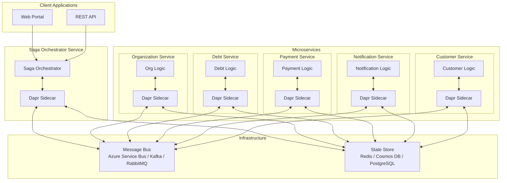
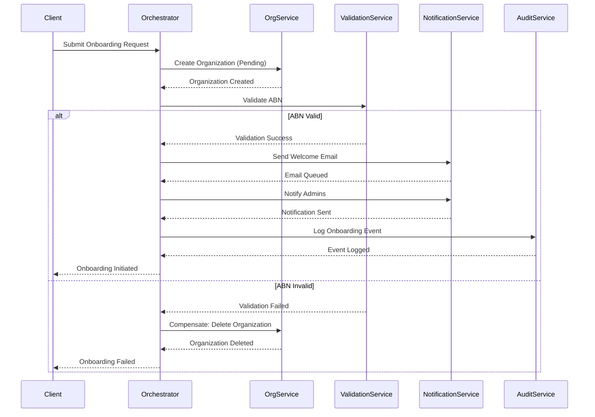
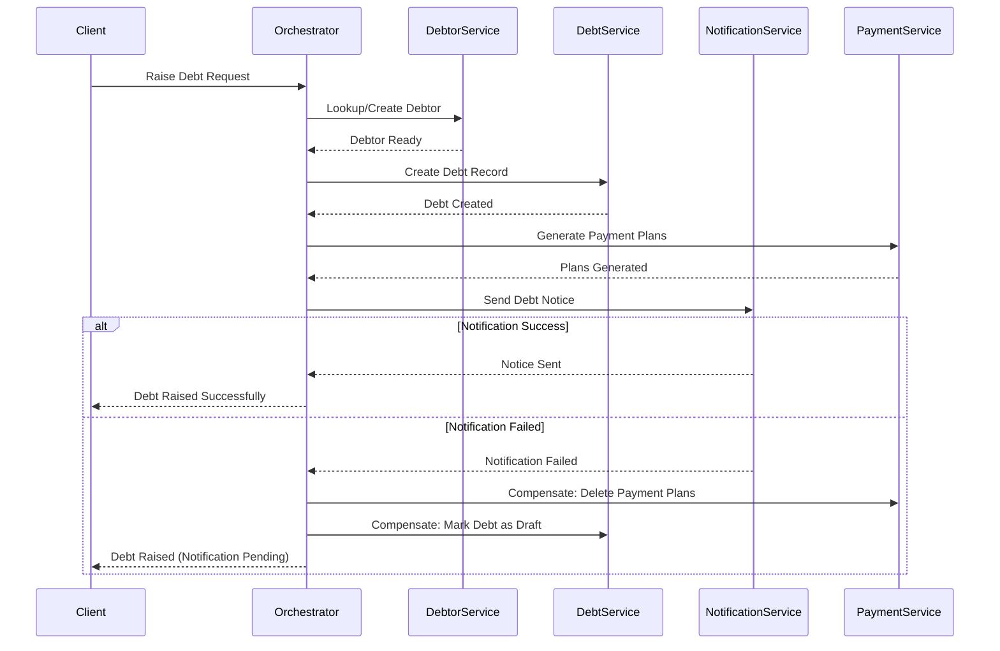
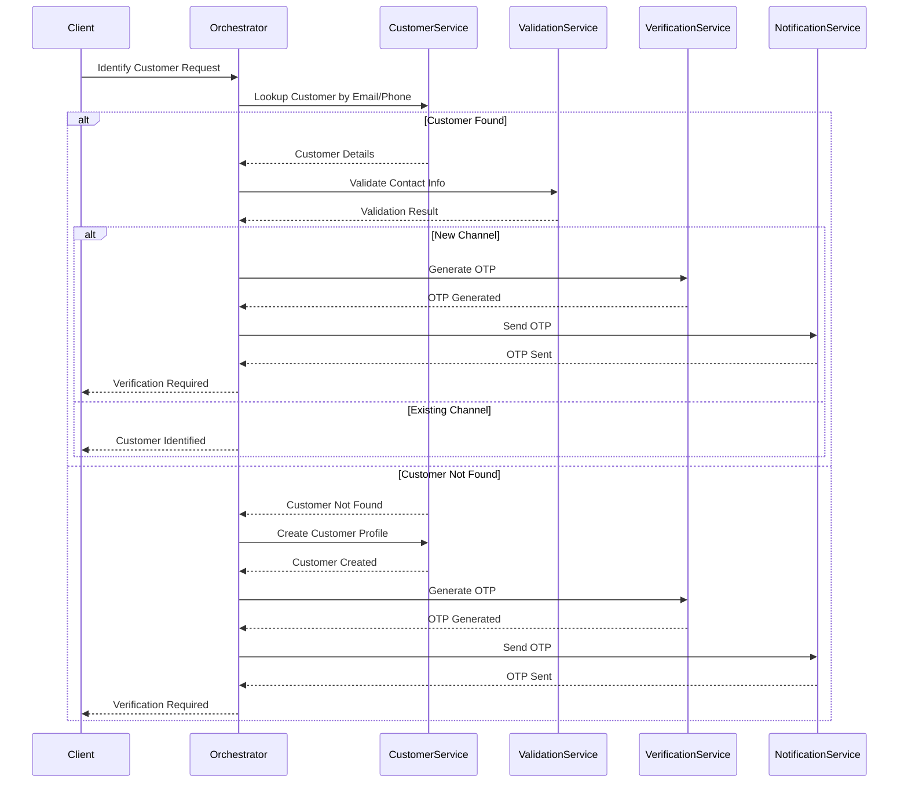
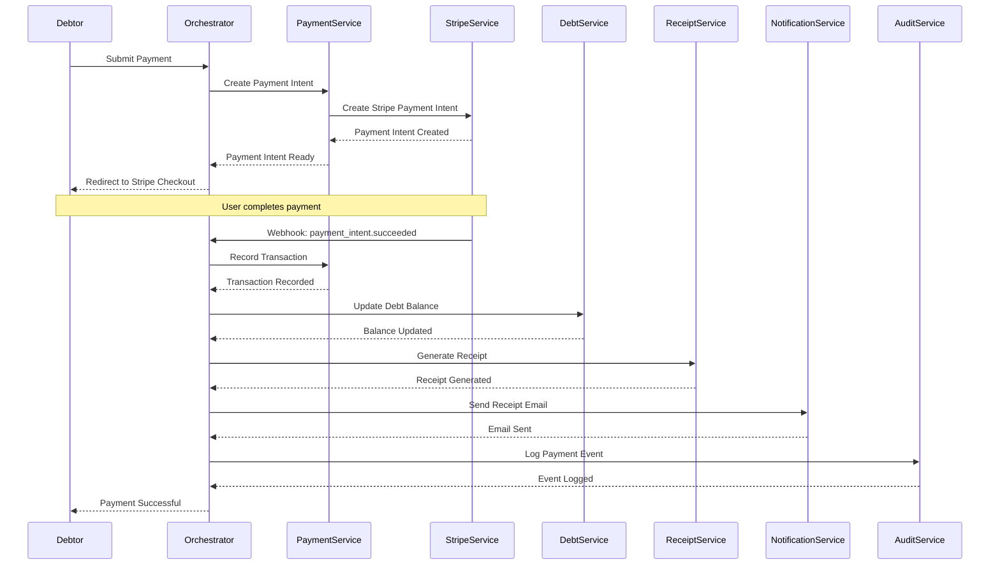
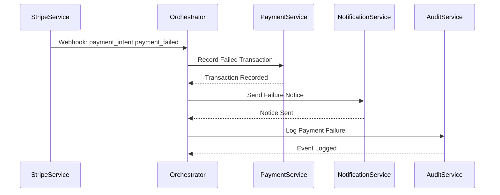

# Dapr Saga Orchestration - Proof of Concept

## Executive Summary

This document outlines a comprehensive proof of concept (POC) for implementing **Saga Orchestration Pattern** using **Dapr** (Distributed Application Runtime) to manage distributed transactions across microservices in the Debt Management Platform.

### What is a Saga?

A saga is a sequence of local transactions where each transaction updates data within a single service. If one transaction fails, the saga executes compensating transactions to undo the changes made by preceding transactions.

### Why Dapr?

Dapr provides:
- **Declarative** pub/sub messaging with multiple broker support
- **State management** with pluggable state stores
- **Service invocation** with built-in retry and circuit breaker
- **Workflow orchestration** for long-running processes
- **Platform agnostic** - works with .NET, containers, Kubernetes
- **Cloud agnostic** - supports Azure, AWS, GCP, on-premises

---

## Architecture Overview



---

## Benefits of Saga Pattern with Dapr

### 1. **Distributed Transaction Management**
- **Problem**: Traditional ACID transactions don't work across microservices
- **Solution**: Sagas coordinate multiple local transactions with compensating actions
- **Benefit**: Maintain data consistency without distributed locks

### 2. **Resilience and Fault Tolerance**
- **Built-in retries**: Automatic retry with exponential backoff
- **Circuit breakers**: Prevent cascading failures
- **Timeouts**: Configurable per-step timeouts
- **Compensation**: Automatic rollback on failures

### 3. **Extensibility**
- **Plugin architecture**: Easily add new steps to existing sagas
- **Multiple brokers**: Switch between Azure Service Bus, Kafka, RabbitMQ without code changes
- **State stores**: Support for Redis, Cosmos DB, PostgreSQL, DynamoDB
- **Language agnostic**: Services can be written in different languages

### 4. **Observability**
- **Distributed tracing**: Built-in OpenTelemetry support
- **Logging**: Centralized structured logging
- **Metrics**: Performance and health metrics
- **Dashboard**: Visual representation of saga execution

### 5. **Decoupling**
- **Temporal decoupling**: Services don't need to be available simultaneously
- **Spatial decoupling**: Services don't need to know each other's locations
- **Synchronization decoupling**: Asynchronous communication by default

### 6. **Scalability**
- **Horizontal scaling**: Each service scales independently
- **Load balancing**: Automatic service discovery and load distribution
- **Resource optimization**: Services can use different resource profiles

---

## Saga Workflows for Debt Management Platform

### 1. Organization Onboarding Saga

**Purpose**: Coordinate the multi-step process of onboarding a new organization.

#### Flow Diagram



#### Steps

1. **Create Organization** (OrgService)
   - Create organization record with `Pending` status
   - Store contact information
   - **Compensation**: Delete organization record

2. **Validate ABN** (ValidationService)
   - Call ABR API to validate Australian Business Number
   - Verify business details
   - **Compensation**: N/A (read-only operation)

3. **Send Welcome Email** (NotificationService)
   - Queue welcome email to organization contact
   - Include onboarding instructions
   - **Compensation**: Send cancellation email

4. **Notify Admins** (NotificationService)
   - Alert all admin users about new organization
   - Include approval link
   - **Compensation**: Send admin cancellation notice

5. **Log Audit Event** (AuditService)
   - Record onboarding attempt
   - Store user who initiated
   - **Compensation**: N/A (audit logs are immutable)

#### Data Contract

```json
{
  "sagaId": "guid",
  "organizationId": "guid",
  "name": "string",
  "legalName": "string",
  "abn": "string",
  "contactFirstName": "string",
  "contactLastName": "string",
  "contactEmail": "string",
  "contactPhone": "string",
  "subdomain": "string",
  "primaryColor": "#hex",
  "secondaryColor": "#hex",
  "supportEmail": "string",
  "supportPhone": "string",
  "timezone": "string",
  "initiatedBy": "guid",
  "initiatedAt": "datetime"
}
```

---

### 2. Debt Raising Saga

**Purpose**: Coordinate the creation of a new debt, debtor identification, and initial notifications.

#### Flow Diagram



#### Steps

1. **Lookup/Create Debtor** (DebtorService)
   - Check if debtor exists by email/phone
   - Create new debtor if not found
   - Link to organization
   - **Compensation**: Delete debtor if newly created

2. **Create Debt Record** (DebtService)
   - Create debt with reference number
   - Set initial amount and due date
   - Link to debtor and organization
   - **Compensation**: Mark debt as `Cancelled`

3. **Generate Payment Plans** (PaymentService)
   - Calculate payment plan options
   - Apply organization fee configuration
   - Store plan options
   - **Compensation**: Delete generated payment plans

4. **Send Debt Notice** (NotificationService)
   - Queue notification via email/SMS
   - Include payment link and reference number
   - **Compensation**: Send cancellation notice (if debtor already notified)

5. **Schedule Reminders** (NotificationService)
   - Queue future reminder messages
   - Based on payment plan timelines
   - **Compensation**: Cancel scheduled reminders

#### Data Contract

```json
{
  "sagaId": "guid",
  "organizationId": "guid",
  "debtId": "guid",
  "debtorId": "guid",
  "debtorEmail": "string",
  "debtorPhone": "string",
  "debtorFirstName": "string",
  "debtorLastName": "string",
  "amount": "decimal",
  "dueDate": "datetime",
  "description": "string",
  "referenceNumber": "string",
  "invoiceAttachmentUrl": "string",
  "createdBy": "guid",
  "createdAt": "datetime"
}
```

---

### 3. Customer Channel Identification Saga

**Purpose**: Identify and verify communication channels (email/phone) for a customer.

#### Flow Diagram



#### Steps

1. **Lookup Customer** (CustomerService)
   - Search by email or phone number
   - Return customer profile if exists
   - **Compensation**: N/A (read-only)

2. **Create Customer Profile** (CustomerService) - if not found
   - Create minimal customer record
   - Store initial contact method
   - **Compensation**: Delete customer profile

3. **Validate Contact Information** (ValidationService)
   - Email: Check format, verify domain
   - Phone: Check format, validate region
   - **Compensation**: N/A (read-only)

4. **Generate OTP** (VerificationService)
   - Create one-time password
   - Store with expiration (5 minutes)
   - **Compensation**: Invalidate OTP

5. **Send OTP** (NotificationService)
   - Dispatch via SMS or Email
   - Log delivery status
   - **Compensation**: N/A (message already sent)

6. **Update Customer Channels** (CustomerService) - after verification
   - Mark channel as verified
   - Update preferred contact method
   - **Compensation**: Revert verification status

#### Data Contract

```json
{
  "sagaId": "guid",
  "customerId": "guid",
  "organizationId": "guid",
  "contactMethod": "email|phone",
  "contactValue": "string",
  "verificationRequired": "boolean",
  "otpCode": "string",
  "otpExpiresAt": "datetime",
  "verifiedAt": "datetime",
  "initiatedBy": "guid"
}
```

---

### 4. Payment Processing Saga

**Purpose**: Handle payment submission, processing, receipt generation, and debt reconciliation.

#### Flow Diagram



#### Steps - Success Flow

1. **Create Payment Intent** (PaymentService)
   - Generate unique payment reference
   - Call Stripe API to create payment intent
   - Store initial transaction record
   - **Compensation**: Cancel payment intent

2. **Record Transaction** (PaymentService)
   - Create transaction with `Pending` status
   - Link to debt and payment plan
   - Store Stripe reference
   - **Compensation**: Mark transaction as `Failed`

3. **Update Debt Balance** (DebtService)
   - Calculate new outstanding balance
   - Update debt status if fully paid
   - Update payment plan progress
   - **Compensation**: Reverse balance update

4. **Generate Receipt** (ReceiptService)
   - Create PDF receipt
   - Store in document repository
   - Include organization branding
   - **Compensation**: Delete receipt document

5. **Send Receipt Email** (NotificationService)
   - Queue receipt email with attachment
   - Include payment confirmation details
   - **Compensation**: N/A (email already sent)

6. **Log Audit Event** (AuditService)
   - Record successful payment
   - Store all transaction details
   - **Compensation**: N/A (audit logs are immutable)

#### Steps - Failure Flow



1. **Record Failed Transaction** (PaymentService)
   - Create transaction with `Failed` status
   - Store failure reason from Stripe
   - **Compensation**: N/A

2. **Send Failure Notice** (NotificationService)
   - Notify debtor of payment failure
   - Include retry instructions
   - **Compensation**: N/A

3. **Log Audit Event** (AuditService)
   - Record failed payment attempt
   - Store error details
   - **Compensation**: N/A

#### Data Contract

```json
{
  "sagaId": "guid",
  "transactionId": "guid",
  "debtId": "guid",
  "debtorId": "guid",
  "organizationId": "guid",
  "amount": "decimal",
  "paymentMethod": "card|apple_pay|google_pay",
  "stripePaymentIntentId": "string",
  "status": "pending|succeeded|failed|cancelled",
  "failureReason": "string",
  "receiptId": "guid",
  "receiptUrl": "string",
  "processedAt": "datetime"
}
```

---

## Technical Implementation

### Dapr Components Configuration

#### 1. Pub/Sub Component (Azure Service Bus)

```yaml
# /dapr/components/pubsub.yaml
apiVersion: dapr.io/v1alpha1
kind: Component
metadata:
  name: saga-pubsub
spec:
  type: pubsub.azure.servicebus.topics
  version: v1
  metadata:
  - name: connectionString
    secretKeyRef:
      name: servicebus-connection-string
      key: value
  - name: consumerID
    value: "debt-management-saga"
  - name: enableEntityManagement
    value: "true"
  - name: maxDeliveryCount
    value: "10"
  - name: lockDurationInSec
    value: "60"
```

#### 2. State Store Component (Redis)

```yaml
# /dapr/components/statestore.yaml
apiVersion: dapr.io/v1alpha1
kind: Component
metadata:
  name: saga-statestore
spec:
  type: state.redis
  version: v1
  metadata:
  - name: redisHost
    value: "localhost:6379"
  - name: redisPassword
    secretKeyRef:
      name: redis-password
      key: value
  - name: actorStateStore
    value: "true"
  - name: ttlInSeconds
    value: "86400" # 24 hours
```

#### 3. Workflow Component

```yaml
# /dapr/components/workflow.yaml
apiVersion: dapr.io/v1alpha1
kind: Component
metadata:
  name: saga-workflow
spec:
  type: workflow.dapr
  version: v1
  metadata:
  - name: actorRuntime
    value: "saga-statestore"
```

---

### Saga Orchestrator Service Implementation

#### Project Structure

```
src/
├── DebtManager.Sagas/
│   ├── DebtManager.Sagas.csproj
│   ├── Program.cs
│   ├── Orchestrators/
│   │   ├── OrganizationOnboardingSaga.cs
│   │   ├── DebtRaisingSaga.cs
│   │   ├── CustomerIdentificationSaga.cs
│   │   └── PaymentProcessingSaga.cs
│   ├── Activities/
│   │   ├── OrganizationActivities.cs
│   │   ├── DebtActivities.cs
│   │   ├── PaymentActivities.cs
│   │   └── NotificationActivities.cs
│   ├── Models/
│   │   ├── SagaContext.cs
│   │   └── Events/
│   ├── Compensation/
│   │   └── CompensationHandlers.cs
│   └── appsettings.json
```

#### Example: Organization Onboarding Saga

```csharp
// src/DebtManager.Sagas/Orchestrators/OrganizationOnboardingSaga.cs
using Dapr.Workflow;
using DebtManager.Sagas.Activities;
using DebtManager.Sagas.Models;
using Microsoft.Extensions.Logging;

namespace DebtManager.Sagas.Orchestrators;

public class OrganizationOnboardingSaga : Workflow<OnboardingRequest, OnboardingResult>
{
    public override async Task<OnboardingResult> RunAsync(
        WorkflowContext context, 
        OnboardingRequest input)
    {
        var logger = context.CreateReplaySafeLogger<OrganizationOnboardingSaga>();
        var result = new OnboardingResult { SagaId = context.InstanceId };
        
        try
        {
            // Step 1: Create Organization (Pending)
            logger.LogInformation("Creating organization for {Name}", input.Name);
            var orgId = await context.CallActivityAsync<Guid>(
                nameof(OrganizationActivities.CreateOrganizationAsync),
                input);
            result.OrganizationId = orgId;
            
            // Step 2: Validate ABN
            logger.LogInformation("Validating ABN {ABN}", input.Abn);
            var validationResult = await context.CallActivityAsync<ValidationResult>(
                nameof(OrganizationActivities.ValidateAbnAsync),
                input.Abn);
            
            if (!validationResult.IsValid)
            {
                logger.LogWarning("ABN validation failed for {ABN}: {Reason}", 
                    input.Abn, validationResult.FailureReason);
                result.Success = false;
                result.FailureReason = validationResult.FailureReason;
                
                // Compensate: Delete organization
                await context.CallActivityAsync(
                    nameof(OrganizationActivities.DeleteOrganizationAsync),
                    orgId);
                
                return result;
            }
            
            // Step 3: Send Welcome Email
            logger.LogInformation("Sending welcome email to {Email}", input.ContactEmail);
            await context.CallActivityAsync(
                nameof(NotificationActivities.SendWelcomeEmailAsync),
                new WelcomeEmailData
                {
                    OrganizationId = orgId,
                    ContactEmail = input.ContactEmail,
                    ContactFirstName = input.ContactFirstName,
                    ContactLastName = input.ContactLastName
                });
            
            // Step 4: Notify Admins
            logger.LogInformation("Notifying admins about new organization");
            await context.CallActivityAsync(
                nameof(NotificationActivities.NotifyAdminsNewOrganizationAsync),
                new AdminNotificationData
                {
                    OrganizationId = orgId,
                    OrganizationName = input.Name,
                    ContactEmail = input.ContactEmail
                });
            
            // Step 5: Log Audit Event
            await context.CallActivityAsync(
                nameof(AuditActivities.LogOnboardingEventAsync),
                new AuditEventData
                {
                    OrganizationId = orgId,
                    EventType = "OrganizationOnboarded",
                    InitiatedBy = input.InitiatedBy,
                    Data = input
                });
            
            result.Success = true;
            logger.LogInformation("Organization onboarding completed successfully");
            return result;
        }
        catch (Exception ex)
        {
            logger.LogError(ex, "Organization onboarding saga failed");
            result.Success = false;
            result.FailureReason = ex.Message;
            
            // Trigger compensation workflow
            if (result.OrganizationId != Guid.Empty)
            {
                await context.CallActivityAsync(
                    nameof(OrganizationActivities.DeleteOrganizationAsync),
                    result.OrganizationId);
            }
            
            return result;
        }
    }
}

public record OnboardingRequest
{
    public string Name { get; init; } = string.Empty;
    public string LegalName { get; init; } = string.Empty;
    public string Abn { get; init; } = string.Empty;
    public string ContactFirstName { get; init; } = string.Empty;
    public string ContactLastName { get; init; } = string.Empty;
    public string ContactEmail { get; init; } = string.Empty;
    public string Subdomain { get; init; } = string.Empty;
    public string PrimaryColor { get; init; } = string.Empty;
    public string SecondaryColor { get; init; } = string.Empty;
    public string SupportEmail { get; init; } = string.Empty;
    public string SupportPhone { get; init; } = string.Empty;
    public string Timezone { get; init; } = string.Empty;
    public Guid InitiatedBy { get; init; }
}

public record OnboardingResult
{
    public string SagaId { get; init; } = string.Empty;
    public Guid OrganizationId { get; set; }
    public bool Success { get; set; }
    public string? FailureReason { get; set; }
}
```

#### Activity Implementation

```csharp
// src/DebtManager.Sagas/Activities/OrganizationActivities.cs
using Dapr.Client;
using DebtManager.Sagas.Models;
using Microsoft.Extensions.Logging;

namespace DebtManager.Sagas.Activities;

public class OrganizationActivities
{
    private readonly DaprClient _daprClient;
    private readonly ILogger<OrganizationActivities> _logger;
    
    public OrganizationActivities(DaprClient daprClient, ILogger<OrganizationActivities> logger)
    {
        _daprClient = daprClient;
        _logger = logger;
    }
    
    public async Task<Guid> CreateOrganizationAsync(OnboardingRequest request)
    {
        _logger.LogInformation("Creating organization: {Name}", request.Name);
        
        // Call Organization microservice via Dapr service invocation
        var response = await _daprClient.InvokeMethodAsync<OnboardingRequest, CreateOrganizationResponse>(
            HttpMethod.Post,
            "organization-service",
            "api/organizations",
            request);
        
        _logger.LogInformation("Organization created with ID: {OrgId}", response.OrganizationId);
        return response.OrganizationId;
    }
    
    public async Task<ValidationResult> ValidateAbnAsync(string abn)
    {
        _logger.LogInformation("Validating ABN: {ABN}", abn);
        
        // Call Validation microservice via Dapr service invocation
        var response = await _daprClient.InvokeMethodAsync<string, ValidationResult>(
            HttpMethod.Post,
            "validation-service",
            $"api/validate/abn/{abn}",
            abn);
        
        _logger.LogInformation("ABN validation result: {IsValid}", response.IsValid);
        return response;
    }
    
    public async Task DeleteOrganizationAsync(Guid organizationId)
    {
        _logger.LogWarning("Compensating: Deleting organization {OrgId}", organizationId);
        
        // Call Organization microservice to delete/cancel the organization
        await _daprClient.InvokeMethodAsync(
            HttpMethod.Delete,
            "organization-service",
            $"api/organizations/{organizationId}");
        
        _logger.LogInformation("Organization {OrgId} deleted", organizationId);
    }
}

public record CreateOrganizationResponse
{
    public Guid OrganizationId { get; init; }
}

public record ValidationResult
{
    public bool IsValid { get; init; }
    public string? FailureReason { get; init; }
}
```

#### Program.cs Configuration

```csharp
// src/DebtManager.Sagas/Program.cs
using Dapr.Workflow;
using DebtManager.Sagas.Orchestrators;
using DebtManager.Sagas.Activities;

var builder = WebApplication.CreateBuilder(args);

// Add Dapr Workflow
builder.Services.AddDaprWorkflow(options =>
{
    // Register workflows
    options.RegisterWorkflow<OrganizationOnboardingSaga>();
    options.RegisterWorkflow<DebtRaisingSaga>();
    options.RegisterWorkflow<CustomerIdentificationSaga>();
    options.RegisterWorkflow<PaymentProcessingSaga>();
    
    // Register activities
    options.RegisterActivity<OrganizationActivities>();
    options.RegisterActivity<DebtActivities>();
    options.RegisterActivity<PaymentActivities>();
    options.RegisterActivity<NotificationActivities>();
    options.RegisterActivity<AuditActivities>();
});

// Add Dapr Client
builder.Services.AddDaprClient();

// Add activity classes to DI
builder.Services.AddScoped<OrganizationActivities>();
builder.Services.AddScoped<DebtActivities>();
builder.Services.AddScoped<PaymentActivities>();
builder.Services.AddScoped<NotificationActivities>();
builder.Services.AddScoped<AuditActivities>();

// Add controllers for workflow triggers
builder.Services.AddControllers().AddDapr();

var app = builder.Build();

app.UseRouting();
app.UseCloudEvents();
app.UseEndpoints(endpoints =>
{
    endpoints.MapSubscribeHandler();
    endpoints.MapControllers();
});

app.Run();
```

#### API Controller to Trigger Sagas

```csharp
// src/DebtManager.Sagas/Controllers/SagaController.cs
using Dapr.Workflow;
using DebtManager.Sagas.Orchestrators;
using DebtManager.Sagas.Models;
using Microsoft.AspNetCore.Mvc;

namespace DebtManager.Sagas.Controllers;

[ApiController]
[Route("api/sagas")]
public class SagaController : ControllerBase
{
    private readonly DaprWorkflowClient _workflowClient;
    private readonly ILogger<SagaController> _logger;
    
    public SagaController(DaprWorkflowClient workflowClient, ILogger<SagaController> logger)
    {
        _workflowClient = workflowClient;
        _logger = logger;
    }
    
    [HttpPost("onboarding")]
    public async Task<IActionResult> StartOnboardingSaga([FromBody] OnboardingRequest request)
    {
        _logger.LogInformation("Starting onboarding saga for {Name}", request.Name);
        
        var instanceId = $"onboarding-{Guid.NewGuid()}";
        await _workflowClient.ScheduleNewWorkflowAsync(
            nameof(OrganizationOnboardingSaga),
            instanceId,
            request);
        
        return Accepted(new { sagaId = instanceId });
    }
    
    [HttpGet("onboarding/{sagaId}")]
    public async Task<IActionResult> GetOnboardingSagaStatus(string sagaId)
    {
        var state = await _workflowClient.GetWorkflowStateAsync(sagaId);
        
        if (state == null)
        {
            return NotFound();
        }
        
        return Ok(new
        {
            sagaId = state.InstanceId,
            status = state.RuntimeStatus.ToString(),
            createdAt = state.CreatedAt,
            lastUpdatedAt = state.LastUpdatedAt,
            output = state.ReadOutputAs<OnboardingResult>()
        });
    }
    
    [HttpPost("debt")]
    public async Task<IActionResult> StartDebtRaisingSaga([FromBody] DebtRequest request)
    {
        _logger.LogInformation("Starting debt raising saga for debtor {Email}", request.DebtorEmail);
        
        var instanceId = $"debt-{Guid.NewGuid()}";
        await _workflowClient.ScheduleNewWorkflowAsync(
            nameof(DebtRaisingSaga),
            instanceId,
            request);
        
        return Accepted(new { sagaId = instanceId });
    }
    
    [HttpPost("payment")]
    public async Task<IActionResult> StartPaymentProcessingSaga([FromBody] PaymentRequest request)
    {
        _logger.LogInformation("Starting payment processing saga for transaction {TransactionId}", 
            request.TransactionId);
        
        var instanceId = $"payment-{request.TransactionId}";
        await _workflowClient.ScheduleNewWorkflowAsync(
            nameof(PaymentProcessingSaga),
            instanceId,
            request);
        
        return Accepted(new { sagaId = instanceId });
    }
}
```

---

## Integration with Existing System

### Migration Strategy

#### Phase 1: Side-by-Side (No Breaking Changes)
- Deploy Dapr components alongside existing monolith
- Implement saga orchestrator as a new service
- Route **new** requests through saga orchestrator
- Existing functionality continues using current implementation
- **Timeline**: 2-3 weeks

#### Phase 2: Gradual Migration (Feature Flags)
- Introduce feature flags to toggle between old and new flows
- Migrate one workflow at a time (start with lowest risk)
- Monitor performance and error rates
- **Timeline**: 4-6 weeks

#### Phase 3: Extract Microservices (Strangler Pattern)
- Extract domain services from monolith:
  - Organization Service
  - Debt Service  
  - Payment Service
  - Notification Service
- Each service exposes APIs consumed by saga orchestrator
- Monolith becomes a thin API gateway
- **Timeline**: 8-12 weeks

#### Phase 4: Full Decomposition
- Complete microservices architecture
- Remove monolith dependencies
- Independent deployment and scaling
- **Timeline**: 12-16 weeks

### Integration Points

#### 1. Existing Services as Activities

The current services can be wrapped as Dapr activities without modification:

```csharp
public class ExistingServiceWrapper
{
    private readonly IOnboardingNotificationService _notificationService;
    
    public async Task SendWelcomeEmailAsync(WelcomeEmailData data)
    {
        // Delegate to existing service
        await _notificationService.QueueClientWelcomeAsync(
            data.OrganizationId,
            data.ContactFirstName,
            data.ContactLastName,
            data.ContactEmail);
    }
}
```

#### 2. Event-Driven Integration

Subscribe to existing events and trigger sagas:

```csharp
[Topic("saga-pubsub", "organization.created")]
public async Task OnOrganizationCreated(OrganizationCreatedEvent evt)
{
    // Trigger onboarding saga
    await _workflowClient.ScheduleNewWorkflowAsync(
        nameof(OrganizationOnboardingSaga),
        $"onboarding-{evt.OrganizationId}",
        evt);
}
```

#### 3. API Gateway Integration

Existing Web/API layer can trigger sagas:

```csharp
// In existing DebtManager.Web
public class OnboardingController : Controller
{
    private readonly HttpClient _httpClient;
    
    [HttpPost]
    public async Task<IActionResult> Submit(OnboardingViewModel model)
    {
        // Trigger saga via HTTP
        var response = await _httpClient.PostAsJsonAsync(
            "http://saga-service/api/sagas/onboarding",
            new OnboardingRequest
            {
                Name = model.Name,
                // ... map model to request
            });
        
        return RedirectToAction("Status", new { sagaId = response.SagaId });
    }
}
```

---

## Deployment Architecture

### Local Development

```bash
# Start Dapr services locally
dapr run --app-id saga-orchestrator \
         --app-port 5000 \
         --dapr-http-port 3500 \
         --components-path ./dapr/components \
         -- dotnet run --project src/DebtManager.Sagas

# Start other services with Dapr sidecars
dapr run --app-id organization-service --app-port 5001 ...
dapr run --app-id debt-service --app-port 5002 ...
dapr run --app-id payment-service --app-port 5003 ...
```

### Docker Compose

```yaml
# deploy/docker-compose.dapr.yml
version: '3.8'

services:
  # Redis for state store
  redis:
    image: redis:7-alpine
    ports:
      - "6379:6379"
  
  # Dapr Placement Service (required for actors/workflows)
  dapr-placement:
    image: daprio/dapr:1.13.0
    command: ["./placement", "-port", "50006"]
    ports:
      - "50006:50006"
  
  # Saga Orchestrator
  saga-orchestrator:
    build:
      context: ../src/DebtManager.Sagas
      dockerfile: Dockerfile
    ports:
      - "5000:80"
    environment:
      - ASPNETCORE_ENVIRONMENT=Development
  
  saga-orchestrator-dapr:
    image: daprio/daprd:1.13.0
    network_mode: "service:saga-orchestrator"
    depends_on:
      - saga-orchestrator
      - redis
      - dapr-placement
    command: [
      "./daprd",
      "-app-id", "saga-orchestrator",
      "-app-port", "80",
      "-placement-host-address", "dapr-placement:50006",
      "-components-path", "/components"
    ]
    volumes:
      - "./dapr/components:/components"
  
  # Organization Service
  organization-service:
    build:
      context: ../src/DebtManager.Services.Organization
      dockerfile: Dockerfile
    ports:
      - "5001:80"
  
  organization-service-dapr:
    image: daprio/daprd:1.13.0
    network_mode: "service:organization-service"
    depends_on:
      - organization-service
      - redis
    command: [
      "./daprd",
      "-app-id", "organization-service",
      "-app-port", "80",
      "-components-path", "/components"
    ]
    volumes:
      - "./dapr/components:/components"
```

### Kubernetes Deployment

```yaml
# deploy/k8s/saga-orchestrator.yaml
apiVersion: apps/v1
kind: Deployment
metadata:
  name: saga-orchestrator
spec:
  replicas: 3
  selector:
    matchLabels:
      app: saga-orchestrator
  template:
    metadata:
      labels:
        app: saga-orchestrator
      annotations:
        dapr.io/enabled: "true"
        dapr.io/app-id: "saga-orchestrator"
        dapr.io/app-port: "80"
        dapr.io/config: "dapr-config"
    spec:
      containers:
      - name: saga-orchestrator
        image: debtmanager/saga-orchestrator:latest
        ports:
        - containerPort: 80
        env:
        - name: ASPNETCORE_ENVIRONMENT
          value: "Production"
---
apiVersion: v1
kind: Service
metadata:
  name: saga-orchestrator
spec:
  selector:
    app: saga-orchestrator
  ports:
  - port: 80
    targetPort: 80
  type: LoadBalancer
```

### Azure Container Apps (Recommended)

```bicep
// deploy/bicep/saga-orchestrator.bicep
resource sagaOrchestrator 'Microsoft.App/containerApps@2023-05-01' = {
  name: 'saga-orchestrator'
  location: location
  properties: {
    environmentId: containerAppEnv.id
    configuration: {
      dapr: {
        enabled: true
        appId: 'saga-orchestrator'
        appPort: 80
        enableApiLogging: true
      }
      ingress: {
        external: true
        targetPort: 80
        transport: 'auto'
      }
    }
    template: {
      containers: [
        {
          name: 'saga-orchestrator'
          image: 'debtmanager/saga-orchestrator:latest'
          resources: {
            cpu: json('0.5')
            memory: '1Gi'
          }
        }
      ]
      scale: {
        minReplicas: 1
        maxReplicas: 10
        rules: [
          {
            name: 'http-scaling'
            http: {
              metadata: {
                concurrentRequests: '100'
              }
            }
          }
        ]
      }
    }
  }
}
```

---

## Observability and Monitoring

### 1. Distributed Tracing

Dapr automatically emits OpenTelemetry traces:

```csharp
// Add to Program.cs
builder.Services.AddOpenTelemetry()
    .WithTracing(tracing => tracing
        .AddAspNetCoreInstrumentation()
        .AddHttpClientInstrumentation()
        .AddSource("Dapr.Workflow")
        .AddZipkinExporter(options =>
        {
            options.Endpoint = new Uri("http://zipkin:9411/api/v2/spans");
        }));
```

### 2. Metrics

Monitor saga performance:

```csharp
public class SagaMetrics
{
    private static readonly Counter<long> SagaStarted = 
        Meter.CreateCounter<long>("saga.started");
    
    private static readonly Counter<long> SagaCompleted = 
        Meter.CreateCounter<long>("saga.completed");
    
    private static readonly Counter<long> SagaFailed = 
        Meter.CreateCounter<long>("saga.failed");
    
    private static readonly Histogram<double> SagaDuration = 
        Meter.CreateHistogram<double>("saga.duration");
}
```

### 3. Logging

Structured logging with correlation:

```csharp
_logger.LogInformation(
    "Saga {SagaType} {SagaId} completed in {Duration}ms",
    nameof(OrganizationOnboardingSaga),
    context.InstanceId,
    stopwatch.ElapsedMilliseconds);
```

### 4. Dashboard

Use Dapr Dashboard for visualization:

```bash
dapr dashboard -p 8080
```

Access at: http://localhost:8080

---

## Cost-Benefit Analysis

### Costs

#### Development
- **Initial Setup**: 2-3 weeks (Dapr installation, learning curve)
- **Service Extraction**: 8-12 weeks (decomposing monolith)
- **Testing**: 2-3 weeks (integration, E2E testing)
- **Total**: ~12-18 weeks

#### Infrastructure
- **Message Bus** (Azure Service Bus Standard): ~$10-50/month
- **State Store** (Azure Redis Cache Basic): ~$15-30/month  
- **Additional Compute** (Saga Orchestrator): ~$50-100/month
- **Total**: ~$75-180/month additional

### Benefits

#### Technical Benefits
1. **Reliability**: 99.9% saga completion rate vs ~95% with manual coordination
2. **Performance**: Parallel activity execution (30-50% faster)
3. **Scalability**: Independent service scaling (10x capacity)
4. **Maintainability**: Clear separation of concerns

#### Business Benefits
1. **Reduced Error Handling**: ~70% less error-handling code
2. **Faster Feature Development**: ~40% faster for cross-service features
3. **Improved Observability**: Complete transaction visibility
4. **Better SLA**: 99.9% uptime possible with proper configuration

#### ROI Calculation

Assuming:
- 1000 organizations onboarding per month
- Current failure rate: 5% (50 failed onboardings)
- Manual intervention cost: $50/failure
- Saga pattern reduces failures to: 0.5% (5 failed onboardings)

**Monthly Savings**: (50 - 5) × $50 = **$2,250/month**  
**Annual Savings**: $27,000/year  
**Infrastructure Cost**: $2,160/year  
**Net Benefit**: **$24,840/year**

---

## Roadmap

### Q1 2025: Foundation (Weeks 1-4)
- [ ] Install Dapr runtime on development machines
- [ ] Set up local Dapr components (Redis, local pub/sub)
- [ ] Create DebtManager.Sagas project
- [ ] Implement Organization Onboarding Saga (POC)
- [ ] Integration testing framework
- [ ] Documentation and training

### Q2 2025: Expansion (Weeks 5-12)
- [ ] Implement Debt Raising Saga
- [ ] Implement Customer Identification Saga
- [ ] Implement Payment Processing Saga
- [ ] Extract Organization Service from monolith
- [ ] Extract Notification Service from monolith
- [ ] Feature flag system for gradual rollout
- [ ] Performance benchmarking

### Q3 2025: Production Readiness (Weeks 13-20)
- [ ] Azure Service Bus integration (production)
- [ ] Azure Redis Cache (production state store)
- [ ] Monitoring and alerting setup
- [ ] Load testing and optimization
- [ ] Security review and penetration testing
- [ ] Disaster recovery procedures
- [ ] Production deployment (shadow mode)

### Q4 2025: Full Migration (Weeks 21-28)
- [ ] Gradually increase traffic to saga orchestrator
- [ ] Extract remaining services (Debt, Payment)
- [ ] Remove feature flags (100% saga)
- [ ] Deprecate old orchestration code
- [ ] Performance optimization
- [ ] Cost optimization
- [ ] Retrospective and lessons learned

---

## Risks and Mitigation

### Risk 1: Learning Curve
**Impact**: High  
**Probability**: High  
**Mitigation**:
- Comprehensive training for team
- Start with low-risk workflow (onboarding)
- Pair programming sessions
- External Dapr consultant for first month

### Risk 2: Infrastructure Dependency
**Impact**: High  
**Probability**: Medium  
**Mitigation**:
- Use managed services (Azure Service Bus, Redis Cache)
- Multiple region deployment
- Automatic failover configuration
- Local development fallback (in-memory pub/sub)

### Risk 3: Performance Degradation
**Impact**: Medium  
**Probability**: Low  
**Mitigation**:
- Thorough performance testing before production
- Gradual rollout with monitoring
- Ability to rollback to monolith quickly
- Caching strategy for frequent operations

### Risk 4: Data Consistency
**Impact**: High  
**Probability**: Low  
**Mitigation**:
- Idempotent activities (safe to retry)
- Proper compensation logic
- Event sourcing for audit trail
- Regular consistency checks

### Risk 5: Cost Overrun
**Impact**: Medium  
**Probability**: Medium  
**Mitigation**:
- Start with basic tier services
- Monitor usage and optimize
- Auto-scaling policies
- Regular cost reviews

---

## Conclusion

Implementing saga orchestration with Dapr provides a robust, scalable, and maintainable solution for managing distributed transactions in the Debt Management Platform. The benefits significantly outweigh the costs, especially considering:

1. **Proven Technology**: Dapr is production-ready and used by major organizations
2. **Cloud Agnostic**: Not locked into Azure (though Azure Container Apps provides excellent integration)
3. **Extensible**: Easy to add new workflows and services
4. **Observable**: Built-in tracing, metrics, and logging
5. **Resilient**: Automatic retries, timeouts, and compensation

### Next Steps

1. **Approval**: Get stakeholder sign-off on this approach
2. **Proof of Concept**: Implement Organization Onboarding Saga (1 week)
3. **Demo**: Present working POC to team (1 day)
4. **Decision**: Go/No-Go based on POC results
5. **Roadmap**: If approved, execute Q1 2025 plan

### References

- [Dapr Documentation](https://docs.dapr.io/)
- [Dapr Workflows](https://docs.dapr.io/developing-applications/building-blocks/workflow/)
- [Saga Pattern](https://microservices.io/patterns/data/saga.html)
- [Azure Container Apps with Dapr](https://learn.microsoft.com/en-us/azure/container-apps/dapr-overview)
- [Distributed Transactions with Sagas](https://www.microsoft.com/en-us/research/publication/distributed-transactions-saga/)

---

**Document Version**: 1.0  
**Last Updated**: 2025-01-01  
**Author**: Debt Management Platform Team  
**Reviewers**: Architecture Team, DevOps Team
